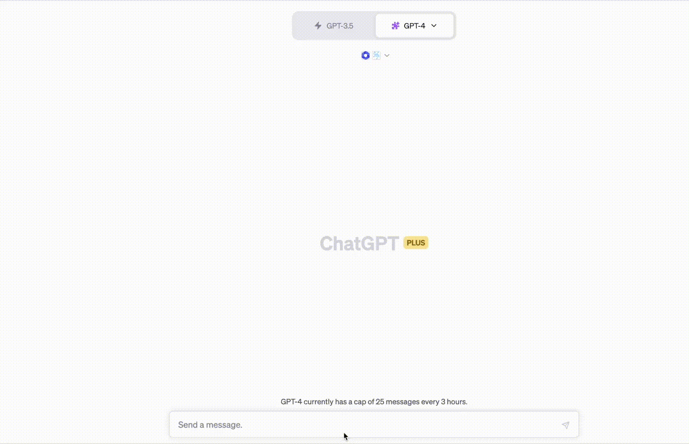
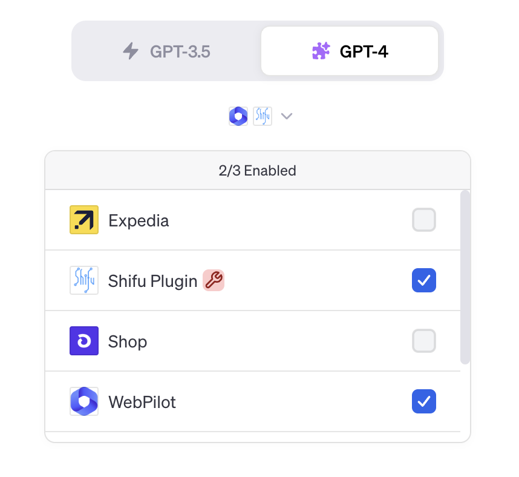
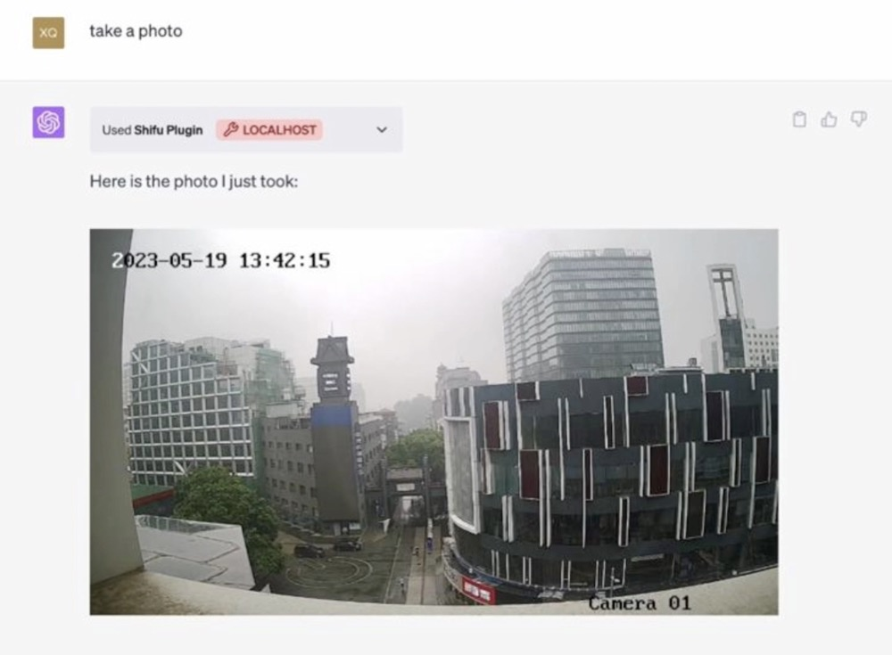

# Shifu Plugin for ChatGPT

The Shifu Plugin is the powerful tool that extends ChatGPT's capability, allowing it to interact with all kinds of Internet of Things (IoT) devices. This plugin bridges the gap between AI and the real world, empowering users to control and interact with their devices using natural language commands.

## Demo 📺

<div align="center">

</div>

Here's a peek behind the scenes at how it all works.

Firstly, we connect an RTSP camera into Shifu. Once connected, Shifu transforms this device into a digital twin, a virtual representation that mirrors the device's capabilities and status in the digital world. Shifu then communicates the microservice APIs of these digital twins to ChatGPT. These APIs serve as the bridge between the natural language processing capabilities of ChatGPT and the functionalities of the IoT devices. When a user issues a command in natural language, ChatGPT steps in to analyze the instruction. Leveraging its advanced AI capabilities, it translates the user's command into an API call. This call is then directed towards the appropriate digital twin, triggering the corresponding action on the actual IoT device.

If you are intrigued by this process, you are more than welcome to try it out yourself by following the guide below!

## Preparation 🎯

[Shifu](https://www.github.com/Edgenesis/shifu) is a Kubernetes native IoT development framework. In order to use it, we need to first deploy a kubernetes cluster. In a demo environment, we suggest using [kind](https://kind.sigs.k8s.io/docs/user/quick-start/). 

Use the following command to create a `kind` cluster:

```bash
kind create cluster
```

Next, install the latest version of [Shifu](https://github.com/Edgenesis/shifu) in your Kubernetes cluster using a single command:

```bash
kubectl apply -f https://raw.githubusercontent.com/Edgenesis/shifu/v0.18.0/pkg/k8s/crd/install/shifu_install.yml
```

Now, you can use [Shifu](https://github.com/Edgenesis/shifu)  to deploy your device's digital twin in your Kubernetes cluster. In this case, we'll deploy a RTSP camera's digital twin using a single command:

```bash
kubectl apply -f examples/camera_shifu.yaml
```

Next, use the `port-forward` command to expose your digital twins outside of Kubernetes to localhost, where ChatGPT can interact with your device. If your device name is `camera`, use the following command:

```bash
kubectl port-forward svc/deviceshifu-camera-service -n deviceshifu 3000: --address=0.0.0.0
```

Finally, prepare all the Python dependencies:

```bash
python3 -m pip install -r requirements.txt
```

Congradulations! You're all set and ready to go! Now it's time to enjoy the fun of interacting with the camera using nothing but natural language commands!

## Guide 🕹️

1. To start the application, run this command:

```bash
python3 main.py
```

2. You can follow [ChatGPT docs](https://platform.openai.com/docs/plugins/introduction) docs to add Shifu Plugin on ChatGPT. By default, the domain is  `localhost:3333`.

3. Add the Shifu Plugin to your ChatGPT. 

4. Since this demo requires displaying photos in the chat, you also need to install the `WebPilot Plugin`.



5. Now, you can chat with ChatGPT and interact with your camera. 



6. You can ask ChatGPT to "take a photo" or "move left", don't let me limit your imagination.

## License
This project is licensed under the [Apache-2.0 license](https://github.com/Edgenesis/shifu-plugin-for-chatgpt/blob/main/LICENSE).

## News 📰
For more information, you are welcome to read: [ChatGPT Breaks into the Physical World: Introducing Shifu Plugin for ChatGPT](https://dev.to/saiyan86/chatgpt-breaks-into-the-physical-world-introducing-shifu-plugin-for-chatgpt-2b4p).

You can also checkout https://github.com/Edgenesis/shifu and https://shifu.dev/ for more information related to Shifu.